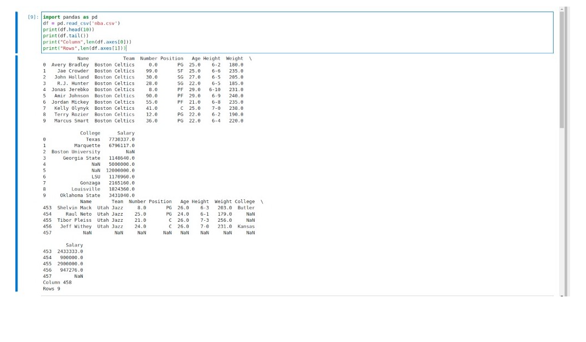

# Read-from-CSV

## AIM:

## ALGORITHM:
### Step 1: 
start
### Step 2:
import pandas as np
### Step 3:
enter csv file in df
### Step 4:
print the row and coloumn
### Step 5:
stop

## PROGRAM:
~~~ python
"""
Name:RAGUL.VK
reg no:21003061
"""
import pandas as pd
df = pd.read_csv('nba.csv')
print(df.head(10))
print(df.tail())
print("Column",len(df.axes[0]))
print("Rows",len(df.axes[1]))

~~~
## OUTPUT:

## RESULT:
thus the program run successfully